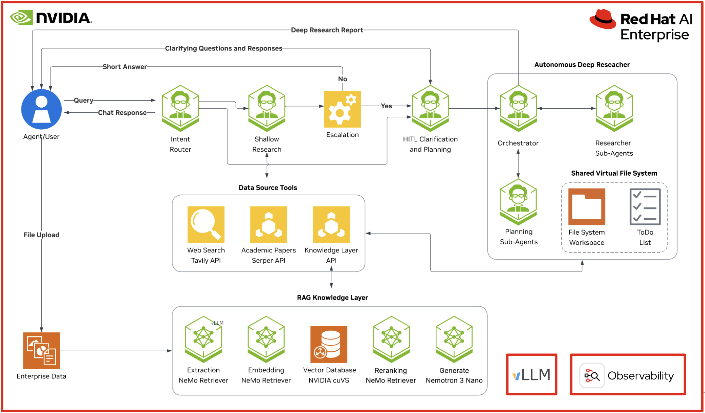

# Deploy Multi-Agent Research Workflows with Red Hat AI and NVIDIA

Build an academic research agent on Red Hat AI Factory with NVIDIA, powered by vLLM models and platform capabilities for observability, governance, and scale.

## Table of Contents

- [Detailed Description](#detailed-description)
  - [See it in Action](#see-it-in-action)
  - [Architecture Diagrams](#architecture-diagrams)
  - [Container Images & Versioning](#container-images--versioning)
- [Requirements](#requirements)
  - [Minimum Hardware Requirements](#minimum-hardware-requirements)
  - [Minimum Software Requirements](#minimum-software-requirements)
  - [Required User Permissions](#required-user-permissions)
- [Deploy](#deploy)
  - [Prerequisites](#prerequisites)
  - [Install](#install)
  - [Delete](#delete)
- [Customization](#customization)
- [References](#references)
- [Tags](#tags)

## Detailed Description

Academic research often requires users to move between quick fact-finding, source discovery, literature review, synthesis, and longer-form reporting. Researchers, faculty, students, and institutional teams may need to gather context from academic papers, web sources, internal knowledge bases, uploaded files, and domain-specific reference material. As the volume of available information grows, the challenge is not only finding relevant sources, but also determining what matters, comparing findings, preserving citation traceability, and turning fragmented information into a useful research output.

This AI quickstart demonstrates how an agentic research application can support academic research workflows by combining fast cited responses with deeper, multi-step investigation. For simple questions, the application can return concise answers with supporting sources. For more complex research requests, it can plan the work, gather information across available tools, ask clarifying questions when needed, and generate a more complete research report. This makes the application useful for research discovery, topic exploration, literature review support, policy research, competitive analysis, and other knowledge-intensive workflows that require both speed and source-backed reasoning.

Built as a customized version of the NVIDIA AI-Q Blueprint for Red Hat AI, this application shows how enterprise-grade research agents can run with NVIDIA models on [Red Hat AI Factory with NVIDIA](https://www.redhat.com/en/products/ai/factory-with-nvidia). The AI-Q Blueprint is built on the [NVIDIA NeMo Agent Toolkit](https://docs.nvidia.com/nemo/agent-toolkit/latest/) and [LangChain Deep Agents](https://docs.langchain.com/oss/python/deepagents/overview), providing teams with a production-ready foundation for building intelligent research workflows. The quickstart adapts this upstream pattern for Red Hat AI environments and adds enterprise platform capabilities such as scalable model serving, observability, governance, and flexible deployment options, highlighting how teams can bring agentic research workflows into hybrid cloud environments while maintaining the operational control needed for production AI applications.

### Architecture Diagrams



This architecture diagram shows a customized NVIDIA AI-Q research workflow running on Red Hat AI Factory with NVIDIA. AI-Q routes user requests across different research paths, from simple responses to shallow, tool-augmented research and deeper multi-step research with planning, sub-agents, and report generation.

The workflow is backed by a small set of shared model endpoints rather than one model per agent component. In this quickstart, models can be served with vLLM on Red Hat AI Enterprise or accessed through NVIDIA NGC cloud inference. The application can also connect to web search, academic search, uploaded enterprise data, and a RAG knowledge layer to support cited, source-grounded responses.

Red Hat AI Enterprise adds the platform capabilities needed to operate the application in production-like environments, including scalable model serving, observability, governance, and hybrid cloud deployment flexibility. The diagram represents the AI-Q workflow and supporting services, while the red callouts highlight Red Hat AI Enterprise additions such as vLLM-based serving and observability.

## Requirements

### Minimum Hardware Requirements

#### GPU Requirements (for local vLLM deployment)

This deployment uses **quantized** and smaller-sized models for efficient GPU memory usage in addition to leveraging optional MIG configuration for added GPU optimization. These requirements are when models are deployed **locally on your GPUs** using vLLM (not using NGC cloud inference).

**Models deployed on your cluster:**
- **RedHatAI/gpt-oss-120b (Orchestrator)**: ~80GB VRAM (quantized)
- **RedHatAI/NVIDIA-Nemotron-3-Nano-30B-A3B-FP8 (Intent & Researcher)**: ~25-30GB VRAM (quantized)
- **nvidia/Nemotron-Mini-4B-Instruct (Summary)**: ~8-10GB VRAM

**Standard deployment requirements (full GPUs, not using MIG):**
- **3x NVIDIA H100** (80GB) or **A100 80GB**
  - GPU 0: gpt-oss-120b (orchestrator) - 1 GPU (~80GB)
  - GPU 1: nemotron-nano-30b (intent & researcher) - 1 GPU (~30GB)
  - GPU 2: nemotron-mini-4b (summary) - 1 GPU (~10GB)

**Optional: Multi-Instance GPU (MIG) optimization**

MIG allows you to partition GPUs into smaller slices, enabling multiple models to share a single GPU efficiently and reduce overall GPU requirements.

NOTE: MIG examples are based on H100 MIG profiles

- **With MIG (all-balanced profile)**: 2x H100 GPUs minimum
  - GPU 0: 2x 3g.47gb (gpt-oss-120b with tensor parallelism across 2 slices)
  - GPU 1: 1x 3g.47gb (nemotron-nano-30b) + 1x 1g.12gb (nemotron-mini-4b)

See `deploy/helm/vllm-models/values.yaml` for detailed MIG configuration examples and options.

**Alternative: NGC API Cloud Deployment (No GPU Required)**

When using NVIDIA NGC API for cloud-hosted inference, **no local GPU resources are required**. This is the quickest way to get started and test AI-Q.

#### Storage

**Based on default deployment configuration** ([`deploy/helm/aiq-rh/values.yaml`](deploy/helm/aiq-rh/values.yaml)):

- **PostgreSQL PersistentVolumeClaim**: 10GB
  - Single PVC (`aiq-postgres-data`) for job metadata, agent checkpoints, and research summaries
  
- **ChromaDB and application data**: Uses ephemeral storage (`emptyDir`)
  - Data does not persist across pod restarts in default configuration
  - To persist ChromaDB vectors and documents, add a PVC for the backend's `/app/data` volume mount

- **Container images**: Standard container registry pull and caching (size varies by deployment target)

**Minimum recommended**: Ensure adequate node storage for PVCs plus container image caching

### Minimum Software Requirements

- Red Hat OpenShift Container Platform (tested with v4.20)
- Red Hat OpenShift AI v3.3.2+ (tested with v3.3.2)
- NVIDIA GPU Operator v24.6.0+
- Helm CLI
- OpenShift Client CLI (oc)

### Required User Permissions

- cluster-admin or namespace admin permissions for creating resources in your target namespace
- Ability to create PersistentVolumeClaims
- Ability to create Secrets
- For vLLM deployment: Permissions to create KServe InferenceServices

## Deploy

The following instructions will deploy the Red Hat Research AI quickstart to your Red Hat AI Enterprise environment using simple Helm deployments.

### Prerequisites

Before deployment, ensure you have the following in place:
- OpenShift cluster with OpenShift AI installed (see version requirements above)
- OpenShift AI has a DataScienceCluster resource with kserve and dashboard components set to managed
- For vLLM deployment: GPU nodes available with NVIDIA GPU Operator installed
- For NGC deployment: No GPU infrastructure required

Obtain the following API keys:
- **NVIDIA_API_KEY** (required for NGC model deployment)
  - Get your API key at: https://org.ngc.nvidia.com/setup/api-key
  - Sign up for NIM access at: https://build.nvidia.com/
- **TAVILY_API_KEY** (needed for web search functionality)
  - Sign up at: https://tavily.com/
- **SERPER_API_KEY** (for academic paper search via Google Scholar)
  - Sign up at: https://serper.dev/

**Note:** At least one data source (Tavily web search, Serper paper search, or uploaded documents) is required to enable research functionality beyond basic conversational queries.

### Install

1. Clone the AI quickstart repository, and git checkout the quickstart deployment branch:

```bash
git clone https://github.com/rh-ai-quickstart/rh-research
cd rh-research
git checkout quickstart

# Initialize submodules (if building custom images or wanting to review source code)
git submodule update --init --recursive
```

**Note:** The submodule initialization step is only required if you plan to build custom container images from source. The pre-built images work without submodules.

2. Ensure you are logged into your OpenShift cluster as cluster-admin or namespace admin:

```bash
oc whoami
```

3. Set environment variables for API keys:

```bash
# NVIDIA API key (required for NGC models, optional for vLLM model pulls)
export NVIDIA_API_KEY="nvapi-..."

# Tavily API key for web search (optional but recommended)
export TAVILY_API_KEY="tvly-..."

# Serper API key for paper search (optional)
export SERPER_API_KEY="..."
```

4. Create namespace and secrets:

```bash
# Create namespace
oc create namespace ns-aiq

# Create application secrets
oc create secret generic aiq-credentials -n ns-aiq \
  --from-literal=NVIDIA_API_KEY="$NVIDIA_API_KEY" \
  --from-literal=TAVILY_API_KEY="$TAVILY_API_KEY" \
  --from-literal=SERPER_API_KEY="$SERPER_API_KEY" \
  --from-literal=DB_USER_NAME="aiq" \
  --from-literal=DB_USER_PASSWORD="aiq_dev"

# For NGC-based deployments, create image pull secret
oc create secret docker-registry ngc-api -n ns-aiq \
  --docker-server=nvcr.io \
  --docker-username='$oauthtoken' \
  --docker-password="$NVIDIA_API_KEY"
```

5. Choose your deployment option:

**AI quickstart decision tree:**
```
Do you have GPU infrastructure?
├─ NO  → Option B: NGC Cloud Models (easy onramp, no GPU needed)
└─ YES → Do you want to run models locally?
          ├─ YES → Option A: vLLM Local Models (recommended for production)
          └─ NO  → Option B: NGC Cloud Models
```

---

**Option A: vLLM Local Models**

Deploy models locally on your GPUs for full deployment control and integration with the Red Hat AI Enterprise observability stack.

```bash
cd deploy/helm

# Step 1: Deploy vLLM models via KServe
helm install vllm-models vllm-models/ \
  -n ns-aiq

# Wait for InferenceServices to be ready (2-5 minutes for model downloads)
oc get inferenceservices -n ns-aiq -w

# Step 2: Deploy AI-Q application with vLLM configuration and Red Hat branding
helm install aiq aiq-rh/ \
  -n ns-aiq \
  -f aiq-rh/values-vllm.yaml \
  -f aiq-rh/values-branding.yaml

# Verify deployment
oc get pods -n ns-aiq
```

**What you get:**
- LLM inference via local vLLM servers on your GPUs
- Embedded LlamaIndex with ChromaDB for document storage
- Full control over model selection and hosting
- Data stays within your cluster
- Red Hat branded UI with custom favicon

---

**Option B: NGC Cloud Models**

Use NVIDIA's cloud-hosted model inference without GPU infrastructure.

```bash
cd deploy/helm

# Deploy AI-Q with default NGC configuration and Red Hat branding
helm install aiq aiq-rh/ \
  -n ns-aiq \
  -f aiq-rh/values-branding.yaml

# Verify deployment
oc get pods -n ns-aiq
```

**What you get:**
- LLM inference via NGC API (cloud-hosted, pay-per-use)
- Embedded LlamaIndex with ChromaDB for document storage
- No GPU infrastructure needed
- Fastest way to get started
- Red Hat branded UI with custom favicon

---

**Advanced Options:**

The NVIDIA AI-Q Blueprint is designed to work optionally with the NVIDIA RAG Blueprint as a RAG backend. We have published an AI quickstart based on this RAG blueprint, similarly customized for Red Hat AI Enterprise deployments, that may be used with this research assistant AI quickstart.

[RAG AI quickstart based on NVIDIA RAG Blueprint](https://docs.redhat.com/en/learn/ai-quickstarts/rh-aml-rag-nvidia)

To integrate with the RAG quickstart, see the full deployment guide for the following configuration options:
- **Option C:** vLLM + RAG Blueprint (`aiq-rh/values-vllm-frag.yaml`)
- **Option D:** NGC + RAG Blueprint (`aiq-rh/values-frag.yaml`)

See [Deployment Guide](docs/advanced-docs/deployment-guide.md) for complete instructions.

---

#### Verify Installation

Check all deployed pods are running:

```bash
oc get pods -n ns-aiq
```

**Expected pods (all deployments):**
- `aiq-backend-*` - Main application backend
- `aiq-frontend-*` - Web UI  
- `aiq-postgres-*` - PostgreSQL database

**Additional pods (vLLM deployment only):**
- `gpt-oss-120b-predictor-*` - Orchestrator model server
- `nemotron-nano-30b-predictor-*` - Intent & researcher model server
- `nemotron-mini-4b-predictor-*` - Summary model server

#### (Optional) Deploy Observability Stack

Deploy the complete observability stack for monitoring, tracing, logging, and metrics visualization:

```bash
cd deploy/helm/observability
chmod +x install-operators.sh deploy.sh

# Step 1: Install operators and wait for CRDs (2-3 minutes)
./install-operators.sh

# Step 2: Deploy observability resources
./deploy.sh
```

This will install:
- **OpenShift Logging** with LokiStack for centralized log aggregation
- **Grafana** for metrics visualization and dashboards
- **OpenTelemetry Collector** for distributed tracing telemetry
- **User Workload Monitoring** for Prometheus metrics collection
- **MLflow** for agent tracing
- **Required operators** (Cluster Observability, Grafana, OpenTelemetry, Logging)

NOTE: For more detailed information on verifying the observability stack deployment and utilizing the resources including configuring tracing in MLflow, review the observability stack guide at docs/advanced-docs/observability-guide.md

### Using the research assistant AI quickstart

1. Get the frontend URL:

```bash
echo "https://$(oc get route -n ns-aiq aiq-frontend -o jsonpath='{.spec.host}')"
```

2. Navigate to the frontend UI in your browser

3. Test the agent with different query types:

**Simple greeting (meta response - instant):**
```
Hello, what can you do?
```
**Expected:** Friendly greeting explaining AI-Q capabilities within 2-5 seconds.

**Shallow research (quick research with citations - 10-30 seconds):**
```
What is Red Hat OpenShift?
```
**Expected:** Factual answer with web search citations within 10-30 seconds.

**Deep research (comprehensive analysis - 2-5 minutes):**
```
Provide a comprehensive analysis of Kubernetes security best practices
```
**Expected:** Multi-section structured report with planning steps, research progress updates, and comprehensive citations. Overall end-to-end processing time varies.

4. (Optional) Upload documents for knowledge retrieval:

Click the upload button to add PDF, DOCX, Markdown or TXT files. Once uploaded, the agent can answer questions based on your document content:

```
What information is in the document I uploaded?
```

**Expected:** Answer synthesized from your uploaded documents with citations to specific sections.

For detailed verification steps and troubleshooting, see the [User Verification Guide](docs/user-docs/user-verification-guide.md).

## Delete

Uninstall the quickstart deployment:

```bash
# Delete AI-Q application
helm uninstall aiq -n ns-aiq

# For vLLM deployments, delete model servers
helm uninstall vllm-models -n ns-aiq

# Delete all PVCs to remove data
oc delete pvc --all -n ns-aiq

# (Optional) Delete the entire namespace
oc delete namespace ns-aiq
```

#### (Optional) Uninstall Observability Stack

If you deployed the observability stack, uninstall it:

```bash
cd deploy/helm/observability
chmod +x uninstall.sh
./uninstall.sh
```

Or manually uninstall in reverse order (resources first, then operators):

```bash
# Uninstall observability resources
helm uninstall mlflow -n redhat-ods-applications
helm uninstall logging-stack -n openshift-logging
helm uninstall grafana -n observability-hub
helm uninstall uwm
helm uninstall otel-collector -n observability-hub

# Uninstall operators (this will also delete their namespaces)
helm uninstall otel-op
helm uninstall grafana-op
helm uninstall cluster-obs
helm uninstall logging-op
```

**Note:** Helm will automatically delete namespaces created by the operator charts. Namespaces may take a few minutes to fully terminate.

## Customization

This quickstart focuses on deploying AI-Q on Red Hat OpenShift AI using pre-built container images. For customization options:

### Quick Configuration Changes

- **UI Branding:** Pre-built images include Red Hat branding by default. The main install commands use `values-branding.yaml` to add a custom favicon and demonstrate runtime branding customization. You may edit this file to change colors, logos, or text for custom demos without rebuilding images.

  See [Customization Reference](docs/advanced-docs/customization-reference.md) for branding details.
- **Model Selection:** Edit `deploy/helm/vllm-models/values.yaml` to change vLLM models
- **Agent Behavior:** Modify inline ConfigMaps in values files (e.g., `aiq-rh/values-vllm.yaml`)
- **Data Sources:** Configure API keys via the `aiq-credentials` secret
- **RAG Integration:** Update `RAG_SERVER_URL` and `RAG_INGEST_URL` environment variables

### Building from Source

Pre-built container images include Red Hat-specific patches applied to the upstream AI-Q v2.1.0 source. To build custom images with your own modifications, see [Customization Reference](docs/advanced-docs/customization-reference.md) for:

- Patch workflow and application
- Building custom frontend/backend images
- Model selection and configuration
- Agent behavior tuning

The customization guide provides step-by-step instructions for working with the source code and patches.

### Container Images & Versioning

This quickstart is based on **NVIDIA AI-Q Blueprint v2.1.0** with Red Hat-specific patches. The deployment uses pre-built container images:

- **Backend:** `quay.io/tasmith/aiq-backend-redhat:2.1.0`  
  NVIDIA AI-Q v2.1.0
  
- **Frontend:** `quay.io/tasmith/aiq-frontend-redhat:2.1.0`  
  NVIDIA AI-Q v2.1.0 + patches 0002-0003 (runtime branding + Red Hat defaults)

Patches are maintained in [`patches/aiq/`](patches/aiq/) and applied during the container build process. See [Customization Reference](docs/advanced-docs/customization-reference.md) for patch details and build instructions.

**Additional Resources:**
- [Deployment Guide](docs/advanced-docs/deployment-guide.md) - All four deployment options (vLLM, NGC, RAG AI quickstart)
- [Configuration Reference](docs/advanced-docs/configuration-reference.md) - YAML parameter reference for advanced configuration

## References

- [NVIDIA NeMo Agent Toolkit](https://docs.nvidia.com/nemo/agent-toolkit/latest/) - Framework for building production-ready AI agents
- [NVIDIA AI-Q Blueprint](https://github.com/NVIDIA-AI-Blueprints/aiq) - Upstream project repository
- [LangChain Deep Agents](https://docs.langchain.com/oss/python/deepagents/overview) - Multi-agent orchestration framework
- [vLLM](https://vllm.ai/) - High-throughput and memory-efficient inference engine for LLMs
- [NVIDIA Nemotron](https://developer.nvidia.com/nemotron) - Family of open models with open weights optimized for specialized AI agents
- [NVIDIA RAG Blueprint](https://github.com/NVIDIA-AI-Blueprints/rag) - Enterprise RAG infrastructure
- [Red Hat AI Quickstarts](https://www.redhat.com/en/blog/introducing-ai-quickstarts) - Collection of AI blueprints for Red Hat AI

## License

This AI quickstart is based on the [NVIDIA AI-Q Blueprint](https://github.com/NVIDIA-AI-Blueprints/aiq), which is licensed under the **Apache License 2.0**. This repository contains Red Hat-specific customizations and deployment configurations for the upstream AI-Q project.

- **AI-Q Project License:** See [licenses/LICENSE](licenses/LICENSE) for the Apache License 2.0 text
- **Third-Party Dependencies:** See [licenses/LICENSE-THIRD-PARTY](licenses/LICENSE-THIRD-PARTY) for all third-party software licenses
- **Deployment and Patch Code:** See [LICENSE](LICENSE) for license content related to the custom code within this repository.

**Note:** This is not the official NVIDIA AI-Q Blueprint repository. For the upstream project, see [NVIDIA-AI-Blueprints/aiq](https://github.com/NVIDIA-AI-Blueprints/aiq).

## Tags

- **Product**: Red Hat AI Enterprise
- **Use case**: Academic research
- **Industry**: Education


